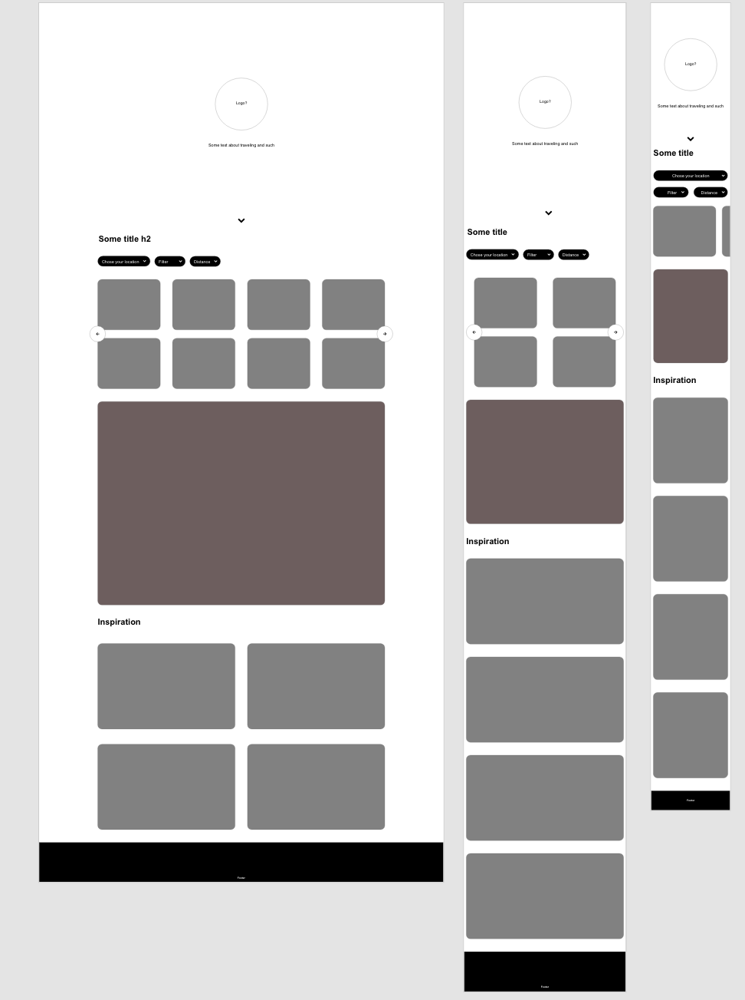
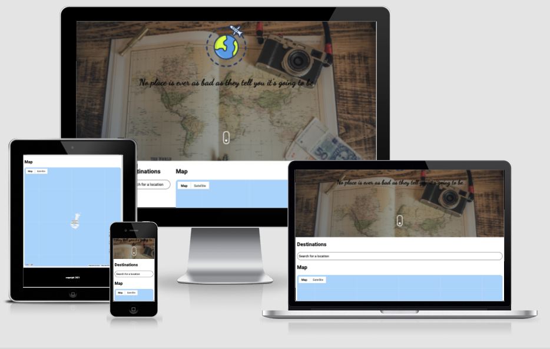

# milestone_project_2

## Morten Johansson || Simple map with searchbar

### Project Overview

This is my second milestone project for Code Institute's Full-stack Developer bootcamp.
This project required me to integrate javascript into my project.

My time for this project was poorly managed so I had to cut a good chunk of what I wanted to accomplish. More on that in the Scope section.
For this project I decided I wanted to make a travel site, with top locations to visit on your chosen destination. But due to time running out, it is now only a map with a searchbar that you can use to look around that area.

---

## UX

### Strategy Plane

Target audience

- People who want to play around with a map.

User Needs

- Look around the map. Scroll and Zoom and search for locations.

What are they looking for?

- Simple map to play with

Site Goals

- Give users a simple map they can explore and play with.

---

## Scope Plane

### Features

#### Current implemented features:

Single page website containing:

- Hero section
- Seach and Map section
- Footer section

Hero section:

- Logo
- Quote about travel

Search And Map Section:

- Search bar for looking up locations. Has autocomplete.
- Map that moves to the locations users search for.

#### Features Left to Implement

Seach and Map Section:

- Add filtering and distance options
- Add a Top Locations section. That shows top things to do within the chosen distance from users position or searched location.

---

## Structure Plane

My website currently consists of a single page app with 3 sections. The structure is like this:

| Website                |
| ---------------------- |
| Hero Section           |
| Search and Map Section |
| Footer                 |

---

## Skeleton Plane

---

## Surface Plane

Typograhpy

The following fonts were used with this project:

- Dancing Script for quote
- Roboto for all other text

Images

Hero Image was taken from https://unsplash.com/photos/duQ1ulzTJbM Photo by https://unsplash.com/@chrislawton
https://www.flaticon.com/authors/icongeek26 for logo

---

## Technologies Used

- HTML5
  - For the structure of the site
- CSS3
  - For the styling of the site
- SASS
  - For modular code, nested rules, and all that make SASS awesome.
- JavaScript

  - Search bar and Maps

- Git & GitHub

  - For version control

- Visual Studio Code
  - Text editor used to code out the site
- Adobe XD

  - For use in creating wireframes and mockup

- CSS Tricks
  - For Grid & Flex consultation

## Testing

I tested this website through dev tools to check the responsiveness.
**Brosers**

- Chrome
- Firefox
- Microsoft Edge
- Safari for mobile

**Devices**

- Desktop
- Iphone 5/SE
- Iphone 6/7/8 as well as their plus version
- iPad/Ipad Pro
- Pixel 2/2XL
- Galaxy S5

During the testing I found no issues and it was responsive on all mentioned above.

---

**HTML and CSS Validation**
I ran both HTML and the compiled sass as well as JS and recieved no errors.

## Deployment

I hosted this website on GitHub Pages using these steps:

- Accessed my github page
- Accessed this projects Repository
- Accessed the settings panel
- Accessed the Pages section of the settings
- Under source i chose the main branch and the /root folder
- I clicked save
- And it was live

---

There are no difference between the deployed verion and the development version.

---

To run this project locally. Follow these steps:

- Access your github account
- Enter this adress: https://github.com/MortenJohansson/personal-website in the serch bar
- Click where it says in a green border "Code"
- You can either use the Git Clone function to clone the repository to your harddrive
- Or you can download it as a ZIP and extract it that way to your harddrive

## Credits

- search bar and maps from google maps documentation

### Media

- unsplash

### Acknowledgements

- Thanks to Adegbenga Adeye (Mentor)

Readme is template from my own milestone project 1
